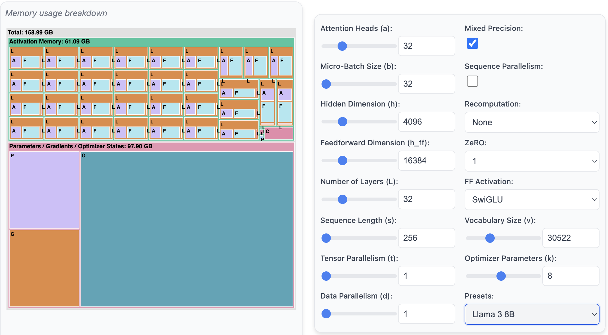
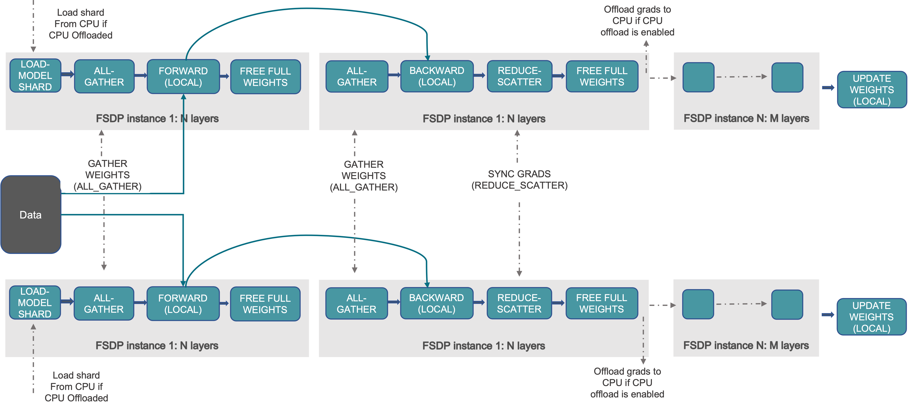

# Chapter1: Adding Data Parallel (DDP, FSDP)

Data parallelism is the first step to scale up training. We will talk about basic DDP and FSDP concepts in this chapter, and scale-up Llama3.1 model with and FSDP in this chapter. We will also using experiment results to show how data parallelism can improve the training speed.

To understanding your model memory usage: 

## 1.1 Distibuted Data Parallel (DDP)
Sending different batch of data to different GPUs to train the model.

- Data Parallel

## 1.2 Fully Sharded Data Parallel (FSDP)
Reduced Peak Memory Usage, in trade-off for communication overhead between GPUs.
FSDP can be considered a decomposition of DDP’s all-reduce into reduce-scatter and all-gather operations

## 1.3 Experiments
### FSDP(shard degree=2, using 2 GPUs in total)

### FSDP(shard degree=8)
